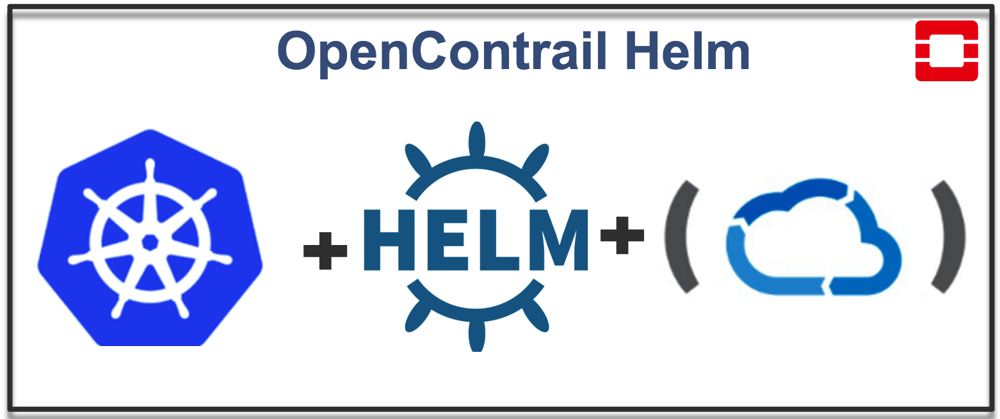
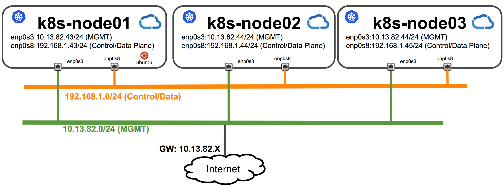

# Installation guide for Contrail HA and Openstack-Helm Ocata


This installation procedure will use Juniper OpenStack Helm infra and OpenStack Helm repo for OpenStack/OpenContrail Ocata clsuter Multi-node deployment.

### Tested with

1. Operating system: Ubuntu 16.04.3 LTS
2. Kernel: 4.4.0-87-generic
3. docker: 1.13.1-cs9
4. helm: v2.7.2
5. kubernetes: v1.9.3
6. openstack: Ocata

### Multinode Topology Diagram

### Pre-requisites

1. Generate SSH key on master node and copy to all nodes, in below example three nodes with IP addresses 10.13.82.43, 10.13.82.44 & 10.13.82.45 is used.

 ```bash
(k8s-master)> ssh-keygen

(k8s-master)> ssh-copy-id -i ~/.ssh/id_rsa.pub 10.13.82.43
(k8s-master)> ssh-copy-id -i ~/.ssh/id_rsa.pub 10.13.82.44
(k8s-master)> ssh-copy-id -i ~/.ssh/id_rsa.pub 10.13.82.45
 ```

2. Please make sure in all nodes NTP is configured and each node is sync to time-server as per your environment. In below example NTP server IP is "10.84.5.100".

```bash
 (k8s-all-nodes)> ntpq -p
     remote           refid      st t when poll reach   delay   offset  jitter
==============================================================================
*10.84.5.100     66.129.255.62    2 u   15   64  377   72.421  -22.686   2.628
```

3. Git clone the necessary repo's using below command on **all Nodes**

  ```bash
  # Download openstack-helm code
  (k8s-all-nodes)> git clone https://github.com/Juniper/openstack-helm.git /opt/openstack-helm
  # Download openstack-helm-infra code
  (k8s-all-nodes)> git clone https://github.com/Juniper/openstack-helm-infra.git /opt/openstack-helm-infra
  # Download contrail-helm-deployer code
  (k8s-all-nodes)> git clone https://github.com/Juniper/contrail-helm-deployer.git /opt/contrail-helm-deployer
  ```

4. Export variables needed by below procedure

  ```bash
  (k8s-master)> cd /opt
  (k8s-master)> export BASE_DIR=$(pwd)
  (k8s-master)> export OSH_PATH=${BASE_DIR}/openstack-helm
  (k8s-master)> export OSH_INFRA_PATH=${BASE_DIR}/openstack-helm-infra
  (k8s-master)> export CHD_PATH=${BASE_DIR}/contrail-helm-deployer
  ```

5. Installing necessary packages.

  ```bash
  (k8s-master)> cd ${OSH_PATH}
  (k8s-master)> ./tools/deployment/developer/common/001-install-packages-opencontrail.sh
  ```

6. Create an inventory file on the master node for ansible base provisoning, please note in below output 10.13.82.43/.44/.45 are nodes IP addresses and will use SSK-key generated in step 1

 ```bash
 #!/bin/bash
(k8s-master)> set -xe
(k8s-master)> cat > /opt/openstack-helm-infra/tools/gate/devel/multinode-inventory.yaml <<EOF
all:
  children:
    primary:
      hosts:
        node_one:
          ansible_port: 22
          ansible_host: 10.13.82.43
          ansible_user: root
          ansible_ssh_private_key_file: /root/.ssh/id_rsa
          ansible_ssh_extra_args: -o StrictHostKeyChecking=no
    nodes:
      hosts:
        node_two:
          ansible_port: 22
          ansible_host: 10.13.82.44
          ansible_user: root
          ansible_ssh_private_key_file: /root/.ssh/id_rsa
          ansible_ssh_extra_args: -o StrictHostKeyChecking=no
        node_three:
          ansible_port: 22
          ansible_host: 10.13.82.45
          ansible_user: root
          ansible_ssh_private_key_file: /root/.ssh/id_rsa
          ansible_ssh_extra_args: -o StrictHostKeyChecking=no
EOF
 ```

7. By default k8s v1.9.3, helm v2.7.2 and cni (v0.6.0) are installed. If you would want to install a different version then edit `${OSH_INFRA_PATH}/tools/gate/devel/multinode-vars.yaml` file to override default values given in `${OSH_INFRA_PATH}/playbooks/vars.yaml`

Sample `multinode-vars.yaml`

 ```bash
(k8s-master)> cat > /opt/openstack-helm-infra/tools/gate/devel/multinode-vars.yaml <<EOF
# version fields
version:
  kubernetes: v1.9.3
  helm: v2.7.2
  cni: v0.6.0

kubernetes:
  network:
    # enp0s8 is your control/data interface, to which kubernetes will bind to
    default_device: enp0s8
  cluster:
    cni: calico
    pod_subnet: 192.168.0.0/16
    domain: cluster.local
docker:
  # List of insecure_registries (local)
  insecure_registries:
    - 10.84.5.81:5000
  # Adding login information to private secure registry
  #  secure_registries:
  #    - name: <docker-registry-name>
  #      username: username@abc.xyz
  #      password: password
EOF
```

8. Run the playbooks on master node

  ```bash
(k8s-master)> set -xe
(k8s-master)> cd ${OSH_INFRA_PATH}
(k8s-master)> make dev-deploy setup-host multinode
(k8s-master)> make dev-deploy k8s multinode
 ```

9. Verify kube-dns connection from all nodes.

Use `nslookup` to verify that you are able to resolve k8s cluster specific names

```bash
  (k8s-all-nodes)> nslookup
  > kubernetes.default.svc.cluster.local
  Server:         10.96.0.10
  Address:        10.96.0.10#53

  Non-authoritative answer:
  Name:   kubernetes.default.svc.cluster.local
  Address: 10.96.0.1
```

### Installation of OpenStack Helm Charts

All nodes by default labeled with "openstack-control-plane" and "openstack-compute-node" labels, you can use following commands to check openstack labels. With this default config OSH pods will be created on all the nodes.

```bash
(k8s-master)>  kubectl get nodes -o wide -l openstack-control-plane=enabled
(k8s-master)> kubectl get nodes -o wide -l openstack-compute-node=enabled
```

**Note**: If requried please disable openstack labels using following commands to restrict OSH pods creation on specific nodes. In following example "openstack-compute-node" lable is disabled on "ubuntu-contrail-9" node.

```bash
(k8s-master)> kubectl label node ubuntu-contrail-9 --overwrite openstack-compute-node=disabled
```

1. Deploy OpenStack Helm charts using following commands.

```bash
  (k8s-master)> set -xe
  (k8s-master)> cd ${OSH_PATH}

  (k8s-master)> ./tools/deployment/multinode/010-setup-client.sh
  (k8s-master)> ./tools/deployment/multinode/021-ingress-opencontrail.sh
  (k8s-master)> ./tools/deployment/multinode/030-ceph.sh
  (k8s-master)> ./tools/deployment/multinode/040-ceph-ns-activate.sh
  (k8s-master)> ./tools/deployment/multinode/050-mariadb.sh
  (k8s-master)> ./tools/deployment/multinode/060-rabbitmq.sh
  (k8s-master)> ./tools/deployment/multinode/070-memcached.sh
  (k8s-master)> ./tools/deployment/multinode/080-keystone.sh
  (k8s-master)> ./tools/deployment/multinode/090-ceph-radosgateway.sh
  (k8s-master)> ./tools/deployment/multinode/100-glance.sh
  (k8s-master)> ./tools/deployment/multinode/110-cinder.sh
  (k8s-master)> ./tools/deployment/multinode/131-libvirt-opencontrail.sh
  (k8s-master)>./tools/deployment/multinode/141-compute-kit-opencontrail.sh
  (k8s-master)> ./tools/deployment/developer/ceph/100-horizon.sh
```

#### Installation of Contrail Helm charts

1. All contrail pods will be deployed in Namespace "contrail". Label Contrail Nodes using below command and following labels are used by Contrail

* Control Nodes: opencontrail.org/controller
* vRouter Kernel: opencontrail.org/vrouter-kernel
* vRouter DPDK: opencontrail.org/vrouter-dpdk

In following example "ubuntu-contrail-11" and "ubuntu-contrail-10" are dpdk vrouter and kernel vrouter compute node respectively. Whereas, ubuntu-contrail-7 ubuntu-contrail-8 ubuntu-contrail-9 are contrail controller nodes

 ```bash
(k8s-master)> kubectl label node  ubuntu-contrail-11 opencontrail.org/vrouter-dpdk=enabled
(k8s-master)> kubectl label node ubuntu-contrail-10 opencontrail.org/vrouter-kernel=enabled
(k8s-master)> kubectl label nodes ubuntu-contrail-7 ubuntu-contrail-8 ubuntu-contrail-9 opencontrail.org/controller=enabled
 ```

2. K8s clusterrolebinding for contrail

 ```bash
(k8s-master)> cd $CHD_PATH
(k8s-master)> kubectl replace -f ${CHD_PATH}/rbac/cluster-admin.yaml
  ```

3. Now deploy opencontrail charts

```bash
 (k8s-master)> cd $CHD_PATH
 (k8s-master)> make

  # Set the IP of your CONTROLLER_NODES in each chart values.yaml and BGP port for multi-node setup (specify your control data ip, if you have one). Please note in below example, 192.168.1.0/24 is "Control/Data" network.
  CONTROLLER_NODES: 192.168.1.43,192.168.1.44,192.168.1.45
  BGP_PORT=1179

  # set the control data network cidr list separated by comma and set the respective gateway
  CONTROL_DATA_NET_LIST=192.168.1.0/24
  VROUTER_GATEWAY=192.168.1.1
  AGENT_MODE: nic
```

Here are each chart **contrail_env** reference values.yaml file (**FYI**)

* **contrail-thirdparty/values.yaml**

```yaml
global:
  contrail_env:
    CONTROLLER_NODES: 192.168.1.43,192.168.1.44,192.168.1.45
    LOG_LEVEL: SYS_NOTICE
    CLOUD_ORCHESTRATOR: openstack
    AAA_MODE: cloud-admin
```

* **contrail-controller/values.yaml**

```yaml
global:
  contrail_env:
    CONTROLLER_NODES: 192.168.1.43,192.168.1.44,192.168.1.45
    LOG_LEVEL: SYS_NOTICE
    CLOUD_ORCHESTRATOR: openstack
    AAA_MODE: cloud-admin
    BGP_PORT: 1179
```

* **contrail-analytics/values.yaml**

```yaml
global:
  contrail_env:
    CONTROLLER_NODES: 192.168.1.43,192.168.1.44,192.168.1.45
    LOG_LEVEL: SYS_NOTICE
    CLOUD_ORCHESTRATOR: openstack
    AAA_MODE: cloud-admin
```

* **contrail-vrouter/values.yaml**

```yaml
global:
  contrail_env:
    CONTROLLER_NODES: 192.168.1.43,192.168.1.44,192.168.1.45
    LOG_LEVEL: SYS_NOTICE
    CLOUD_ORCHESTRATOR: openstack
    AAA_MODE: cloud-admin
    CONTROL_DATA_NET_LIST: 192.168.1.0/24
    VROUTER_GATEWAY: 192.168.1.1
  contrail_env_vrouter_kernel:
    AGENT_MODE: nic
```

Here are helm install commands to deploy Contrail helm chart after setting configuration parameters in "values.yaml" files.

```bash
  (k8s-master)> helm install --name contrail-thirdparty ${CHD_PATH}/contrail-thirdparty \
  --namespace=contrail

  (k8s-master)> helm install --name contrail-controller ${CHD_PATH}/contrail-controller \
  --namespace=contrail

  (k8s-master)> helm install --name contrail-analytics ${CHD_PATH}/contrail-analytics \
  --namespace=contrail

  # Edit contrail-vrouter/values.yaml and make sure that global.images.tags.vrouter_init_kernel is right. Image tag name will be different depending upon your linux. Also set the global.node.host_os to ubuntu or centos depending on your system

  (k8s-master)> helm install --name contrail-vrouter ${CHD_PATH}/contrail-vrouter \
  --namespace=contrail
```

4. Once Contrail PODs are up and running deploy OpenStack Heat chart using following command.

```bash
(k8s-master)> ./tools/deployment/multinode/151-heat-opencontrail.sh
```

5. Run compute kit test using following command at the end.

  ```bash
(k8s-master)> ./tools/deployment/multinode/143-compute-kit-opencontrail-test.sh
  ```

### OSH Contrail Helm Clsuter basic testing

1. Basic Virtual Network and VMs testing

 ```bash
(k8s-master)> export OS_CLOUD=openstack_helm

(k8s-master)> openstack network create MGMT-VN
(k8s-master)> openstack subnet create --subnet-range 172.16.1.0/24 --network MGMT-VN MGMT-VN-subnet

(k8s-master)> openstack server create --flavor m1.tiny --image 'Cirros 0.3.5 64-bit' \
--nic net-id=MGMT-VN \
Test-01

(k8s-master)> openstack server create --flavor m1.tiny --image 'Cirros 0.3.5 64-bit' \
--nic net-id=MGMT-VN \
Test-02
 ```

### Reference

* <https://github.com/Juniper/openstack-helm/blob/master/doc/source/install/multinode.rst>

### [FAQ's](faq.md)
